# ステージ0「Qratch に触ってみよう」

このステージではゲームの仕組みを実際に Qratch を触りながら学習していきます。

## 環境構築

環境構築とは、プログラマが作業をする環境を作ることです。今回はプレイグラウンドというブラウザだけで Qratch を試すことができる環境を使います。

下記のリンクを開いてみてください。

<https://play.qratch.dev/>

するとこのようなページがブラウザで開かれます。これが Qratch のプレイグラウンドです。このステージではこのプレイグラウンドでコードを実行しながらゲームの開発をしていきます。

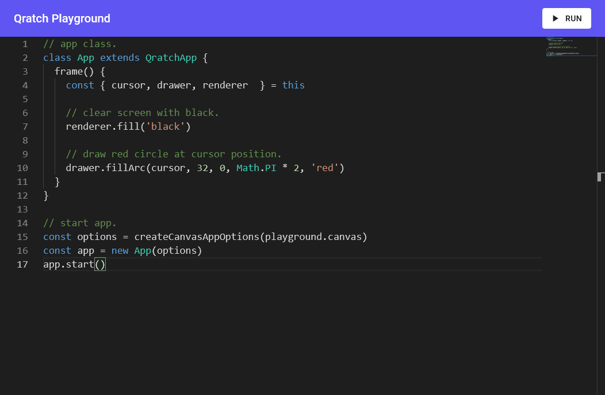

## プレイグラウンドを触ってみよう

プレイグラウンドには最初から以下のようなコードが記述されています。詳しい説明の前にこのコードを実行してみましょう。

```ts
// app class.
class App extends QratchApp {
  frame() {
    const { cursor, drawer, renderer  } = this

    // clear screen with black.
    renderer.fill('black')

    // draw red circle at cursor position.
    drawer.fillArc(cursor, 32, 0, Math.PI * 2, 'red')
  }
}

// start app.
const options = createCanvasAppOptions(playground.canvas)
const app = new App(options)
app.start()
```

右上に「RUN」というボタンがあるので、クリックしてみてください。するとこのような画面が開きます。マウスカーソルを動かすと、画面に表示されている赤い丸が付いてきます。これが先程のコードの実行結果です。

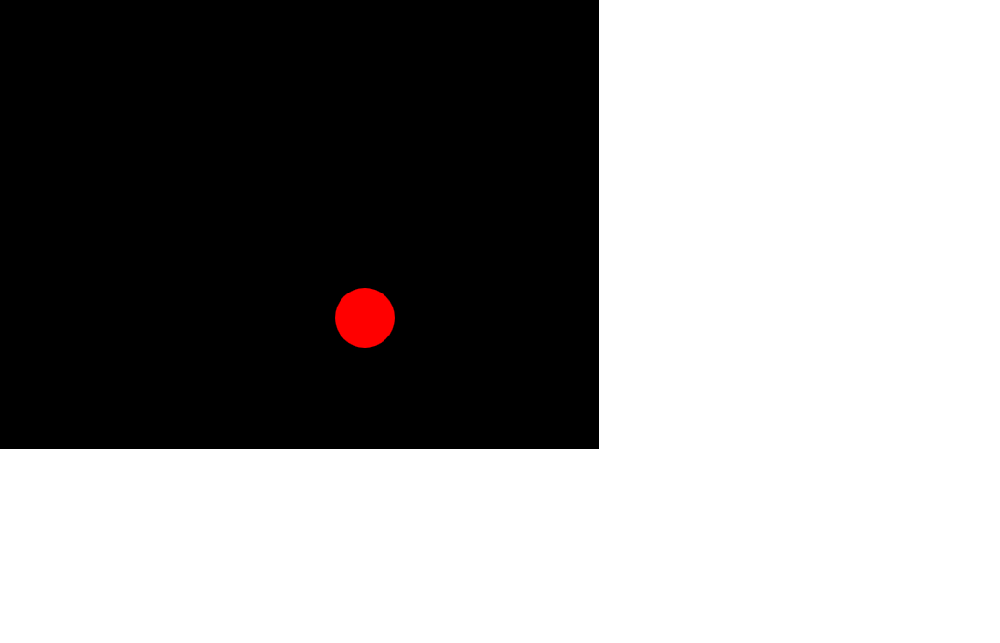

## コードを改造してみよう

次に少しコードを改造してみましょう。コードの7行目にある `renderer.fill('black')` の `black` を `green` にしてみてください。


```ts{7}
// app class.
class App extends QratchApp {
  frame() {
    const { cursor, drawer, renderer  } = this

    // clear screen with black.
    renderer.fill('green')

    // draw red circle at cursor position.
    drawer.fillArc(cursor, 32, 0, Math.PI * 2, 'red')
  }
}

// start app.
const options = createCanvasAppOptions(playground.canvas)
const app = new App(options)
app.start()
```

変更したら実行してみましょう。このように背景が黒色から緑色になったら成功です。

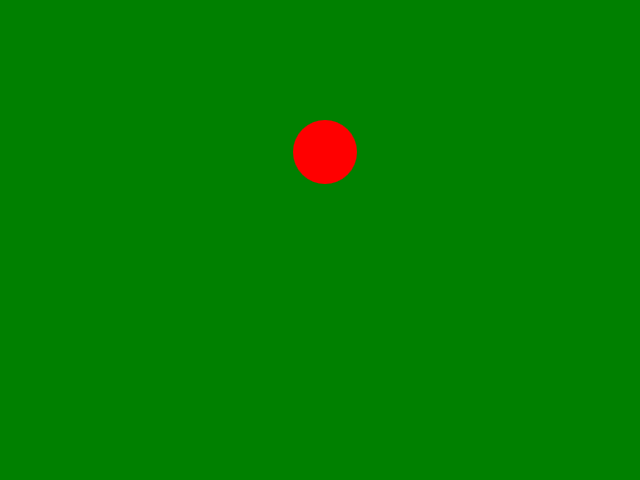

先程の出てきた `renderer.fill()` は画面を好きな色で塗りぶす関数です。

例えば下記のように色の名前を指定してあげることで、自分の好きな色で画面を塗りつぶすことができます。

```ts:no-line-numbers
renderer.fill('white')  // 白色で塗りつぶす
```

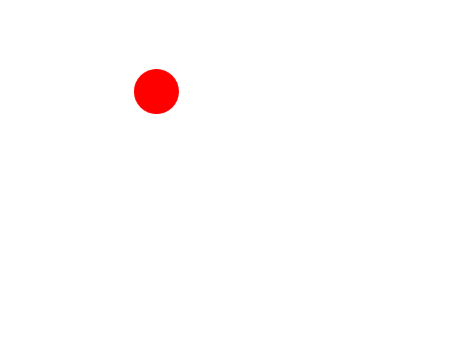

```ts:no-line-numbers
renderer.fill('blue')  // 青色で塗りつぶす
```

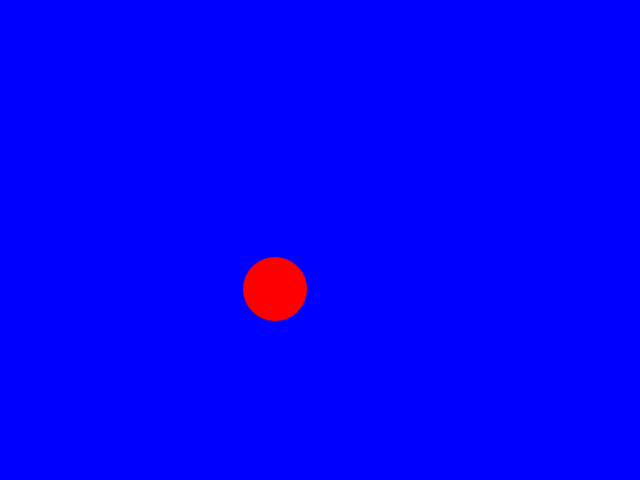

```ts:no-line-numbers
renderer.fill('cyan')  // 白色で塗りつぶす
```

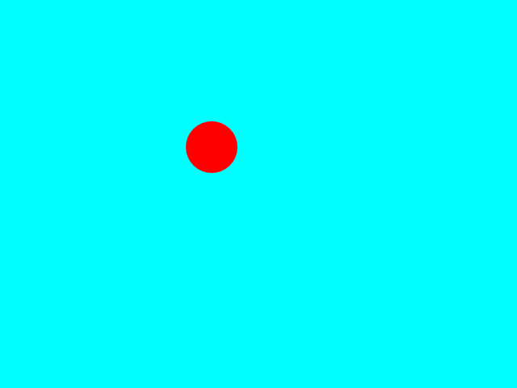

次にコードの10行目を以下のように変更してみましょう。

```ts:{10}
// app class.
class App extends QratchApp {
  frame() {
    const { cursor, drawer, renderer  } = this

    // clear screen with black.
    renderer.fill('black')

    // draw red circle at cursor position.
    drawer.fillArc(cursor, 16, 0, Math.PI, 'blue')
  }
}

// start app.
const options = createCanvasAppOptions(playground.canvas)
const app = new App(options)
app.start()
```

実行すると、青くて小さい半円が描画されます。

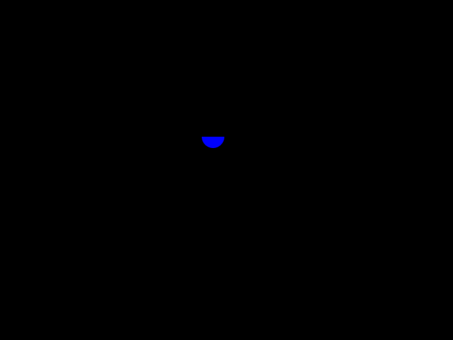

先程の `drawer.fillArc()` は画面に半円を描画する関数で、下記のように引数を指定します。


```ts:no-line-numbers
drawer.fillArc(描画する位置, 半径, 開始角度, 終了角度, '塗りつぶす色')
```

先程の例だと描画する位置に、 `cursor` を指定しています。この `cursor` はコードの 4行目にある `this` からの [オブジェクトの分割代入](https://developer.mozilla.org/ja/docs/Web/JavaScript/Reference/Operators/Destructuring_assignment#object_destructuring) により、初期化されています。

```ts:no-line-numbers
// 4行目のオブジェクトの分割代入
const { cursor, drawer, renderer  } = this
```

`cursor` はマウスカーソルを管理する [`Cursor`](../../../reference/interfaces/Cursor.md) のインスタンスです。

次に半円の開始角度と終了角度に注目してみてください。開始角度には `0` が指定されていますが、終了角度には `Math.PI` が指定されています。`Math.PI` はブラウザで定義されている円周率の定数です。

```ts:no-line-nubmers
//                         ┌─ 開始角度
drawer.fillArc(cursor, 16, 0, Math.PI, 'blue')
//                            └─────┴─ 終了角度
```

これは [ラジアン角度](https://ja.wikipedia.org/wiki/%E3%83%A9%E3%82%B8%E3%82%A2%E3%83%B3) と呼ばれる角度です。別名弧度法とも呼ばれます。

普段私達が使っている角度は度数法と呼ばれ、「円周を360等分した弧の中心に対する角度」と定義されています。

一方弧度法は「円の半径に等しい長さの弧の中心に対する角度」と定義されています。分かりやすくすると、度数法の `180度` は弧度法では `π(PI:円周率)` と表されます。

なので `fillArc` の開始角度に `0` 終了角度に `Math.PI` を指定しているので、度数法に直すと開始角度が `0度` 終了角度が `180度` となり、半円となります。

```ts:no-line-numbers
drawer.fillArc(cursor, 16, 0, Math.PI, 'blue')
```

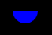

また最初のコードのように開始角度が `0` 終了角度が `Math.PI * 2` は開始角度が `0度` 終了角度が `360度` となり、完全な円になります。

```ts:no-line-numbers
drawer.fillArc(cursor, 16, 0, Math.PI * 2, 'blue')
```

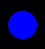

## フレームについて

普段私達がプレイしているゲームは、連続で画面が更新され動いているように見えます。いわばパラパラ漫画のようなものです。

例えば下のようにキャラクターが動いている様子を1枚1枚連続して表示させることで、ゲーム画面で「キャラクターがジャンプする」というアニメーションを描画しているのです。

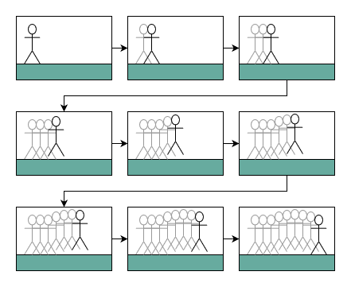

また、この画像1枚1枚のことを「フレーム」と呼び、特定のフレームを指すときは「〇〇フレーム目」と呼びます。

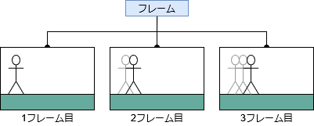

Qratch では下のように `frame` 関数の中にフレームの描画処理を記述することができます。

```ts:no-line-numbers
class App extends QratchApp {
  frame() {
    const { renderer } = this

    renderer.fill('black')

    // フレームの描画処理
    // ...
  }
}
```

なぜフレームごとに `renderer.fill` を呼び出すかというと、フレームを描画するときに、前のフレームで描画されたものを消すためです。試しに、 `renderer.fill` をコメントアウトしてデモのコードを動かしてみましょう。

```ts:{5}
class App extends QratchApp {
  frame() {
    const { cursor, drawer, renderer  } = this

    // renderer.fill('green')

    // draw red circle at cursor position.
    drawer.fillArc(cursor, 32, 0, Math.PI * 2, 'red')
  }
}
```

実行すると下のように1フレーム1フレームが重なって見えます。ゲームなどは通常、画面を塗りつぶしてからキャラクターなどの描画を行うため、フレームの描画の前には一度 `renderer.fill` を呼び出すようにしましょう。

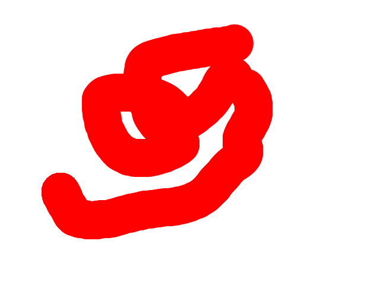

またゲームなどをやっていると [FPS(Frame Per Seconds:フレームレート)](https://ja.wikipedia.org/wiki/%E3%83%95%E3%83%AC%E3%83%BC%E3%83%A0%E3%83%AC%E3%83%BC%E3%83%88) という言葉を耳にします。これは1秒間に処理できるフレームの数のことです。この FPS が高ければ高いほど、ゲームは滑らかに動くようになります。

Qratch は通常 `60 FPS` で動作するため、滑らかに動きます。試しに、FPSを `30 FPS` に制限してみましょう。

デモコードの `App` クラスに下のような `init` 関数を追加しましょう。`ticker.setTargetFPS()` 関数は引数で渡された値を FPS の目標値に設定します。

```ts:{3-5}
// app class.
class App extends QratchApp {
  init() {
    this.ticker.setTargetFPS(30)
  }

  frame() {
    const { cursor, drawer, renderer  } = this

    // clear screen with black.
    renderer.fill('black')

    // draw red circle at cursor position.
    drawer.fillArc(cursor, 32, 0, Math.PI * 2, 'red')
  }
}
```

実行してみましょう。マウスカーソルを動かすと円が動きますが、少し粗い動きになっています。

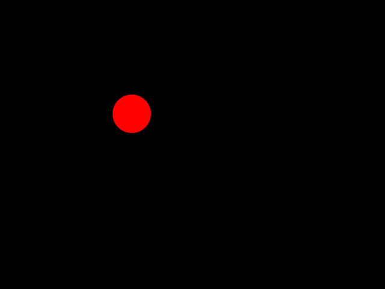

## `QratchApp` クラス

デモコードには `QratchApp` クラスを継承した `App` クラスが定義されています。

```ts:no-line-numbers
class App extends QratchApp {
  frame() {
    // ...
  }
}
```

`QratchApp` クラスは Qratch でアプリ開発するための抽象クラスです。`QratchApp` を継承したクラスは必ず `frame()` 関数を実装する必要があります。

そして `QratchApp` を継承しただけではアプリは動きません。でもコードの15行目から17行目には下のようなコードがあります。

```ts:no-line-numbers
/* 15|*/ const options = createCanvasAppOptions(playground.canvas)
/* 16|*/ const app = new App(options)
/* 17|*/ app.start()
```

まず15行目です。

```ts:no-line-numbers
const options = createCanvasAppOptions(playground.canvas)
```

この行では `createCanvasAppOptions()` 関数を呼び出しています。この関数は `HTMLCanvasElement` を引数に取り、Qratch のアプリを動かすのに必要なオプションを生成しています。生成されるオプションの中には下記のようなものが含まれます。

- `cursor: HTMLElementCursor`
  - カーソルを管理するクラスです。
- `keyboard: HTMLElementKeyboard`
  - キー入力を管理するクラスです。
- `mouse: HTMLElementMouse`
  - マウス入力(クリックなど)を管理するクラスです。
- `renderer: CanvasRenderer`
  - `CanvasRenderingContext2D` への描画APIを提供するクラスです。
- `ticker: RequestAnimationFrameTicker`
  - `requestAnimationFrame()` 関数を利用したフレームを管理するクラスです。
  - `QratchApp` クラスの `frame()` メソッドはこの `ticker` により呼び出されます。

また `createCanvasAppOptions()` への引数に `playground.canvas` を渡しています。`playground.canvas` はプレイグラウンドで実行される際に生成される `HTMLCanvasElement` インスタンスが代入されています。

次に16行目です。

```ts:no-line-numbers
const app = new App(options)
```

この行では先程生成した `options` を `App` クラスのコンストラクタに渡して、インスタンスを生成しています。

最後に17行目です。

```ts:no-line-numbers
app.start()
```

この行はアプリケーションの `init` メソッドを呼び出し、`ticker` によるフレームの呼び出しを開始します。

## 最後に

以上でステージ0は終了です :tada:。お疲れ様でした！
